# Crew Bench

A web application for matching sailing crew to boats for racing events.

Crew Bench has **two complementary ways** to connect:

1. **Crew Pool** — general interest in crewing (no specific race required)
2. **Race Events** — availability and invitations for particular races and series

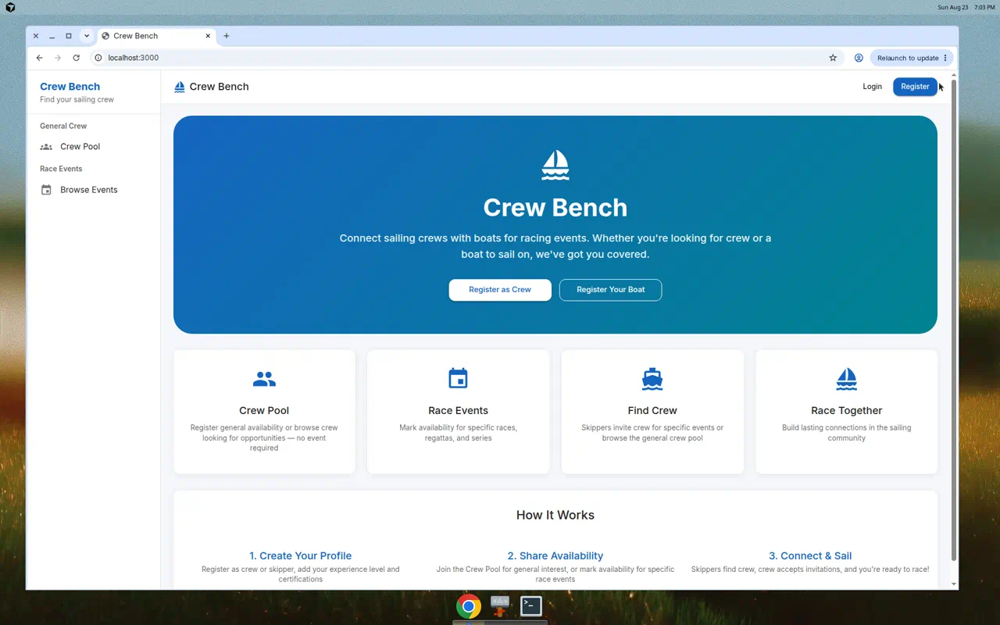

## Features

- **Crew Pool**: Crew register general availability (weekends, Saturdays, date ranges, notes); skippers browse without picking an event
- **Direct messaging**: Skippers can message crew from the Crew Pool; both parties see conversation history under Messages
- **Invite from pool**: Skippers can invite Crew Pool members to a specific event or series (appears in Requests)
- **Crew Pool email alerts**: Skippers can opt in to email when new crew join or re-activate in the pool
- **User Registration**: Register as crew looking for boats or as a skipper with a boat
- **Event Management**: Browse upcoming sailing events, races, and regattas
- **Crew Availability**: Mark yourself available for specific events or an entire series
- **Crew Matching**: Skippers browse available crew for an event and send invitations
- **Request Management**: Accept or decline crew requests (including waitlists)
- **My Schedule**: See confirmed assignments as crew or skipper
- **In-app notifications**: Bell icon with unread count; list, mark read, and open linked pages
- **Web Push (mobile web)**: Optional push notifications when crew requests are sent or responded to
- **Admin Interface**: Create events manually or import from racing calendars
- **Calendar Import**: Import events from external sources like Austin Yacht Club

## Using Crew Bench

### 1. Create a profile

Register as **crew** or **skipper**, then complete your profile (experience, weight, position preferences, contact prefs).

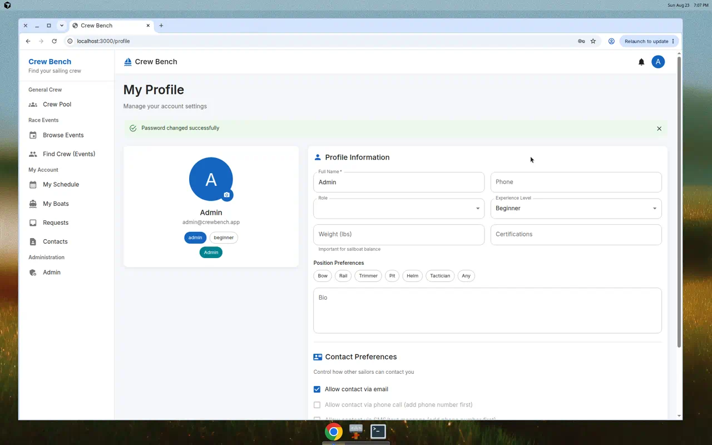

**Crew Pool email alerts** (skippers): on Profile, enable **Email me when new crew join the Crew Pool**. Alerts fire when someone newly registers interest or re-activates a hidden profile (at most one email per hour by default). Without SMTP configured, emails are logged for local development.

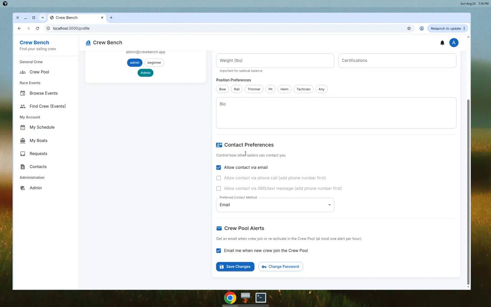

### 2. Crew Pool — general interest (no event required)

Use **Crew Pool** when you want to crew generally, or when skippers want to find people without selecting a race first.

**Register Interest** (crew):

1. Open **Crew Pool** in the sidebar under *General Crew*
2. On **Register Interest**, tap shortcuts such as *Every Saturday*, *Every Weekend*, *Weekdays*, or *Flexible*
3. Optionally add notes and specific date ranges
4. Click **Register interest** / **Update profile**

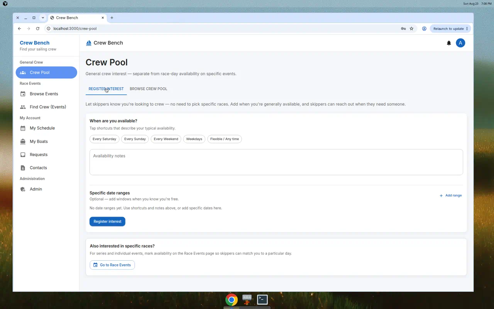

**Browse Crew Pool** (skippers):

1. Open the **Browse Crew Pool** tab
2. Search by name, experience, or notes
3. View availability shortcuts, date ranges, and notes for each person

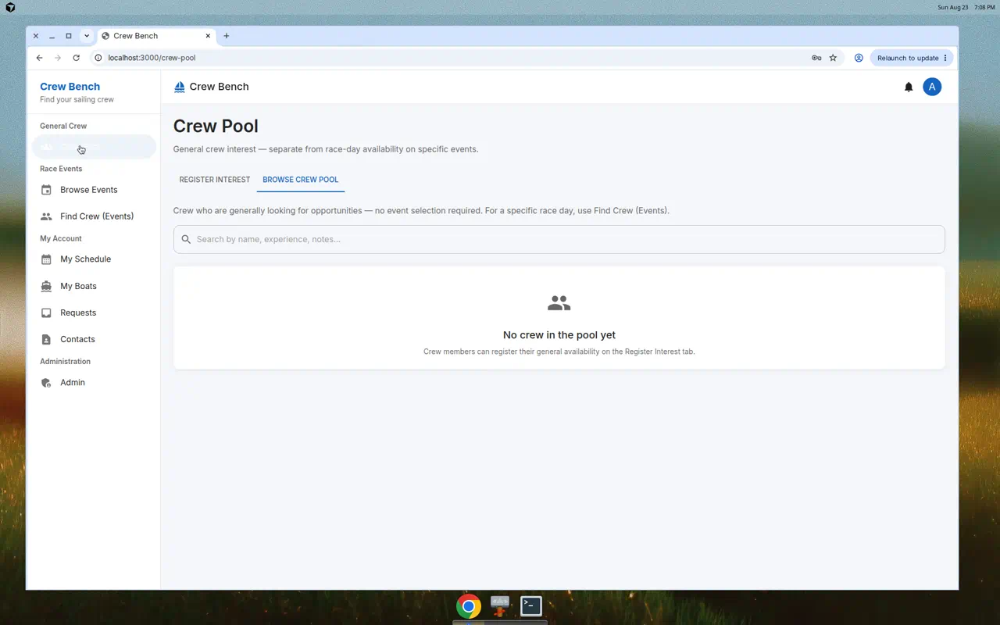

You can hide your profile from skippers or remove it entirely at any time.

**Message crew from the pool** (skippers):

1. On **Browse Crew Pool**, click **Send message** on a crew card
2. Compose a short note (contact preferences are respected)
3. Continue the conversation under **Messages** in *My Account*

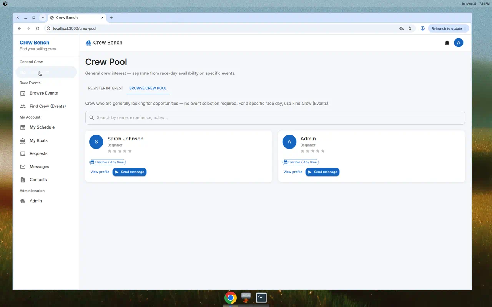

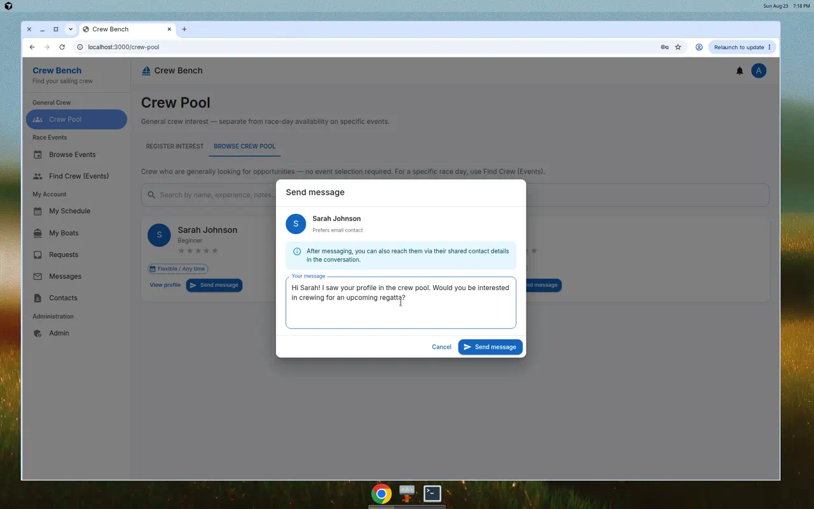

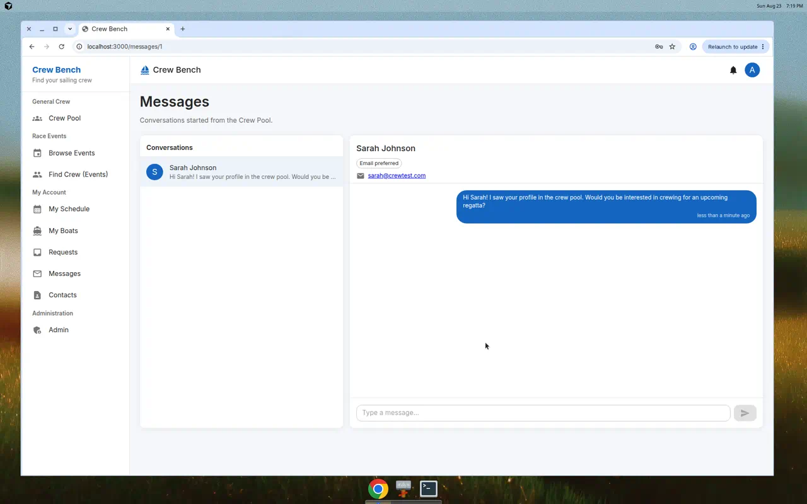

**Invite pool crew to a race** (skippers):

1. Add at least one boat under **My Boats**
2. On **Browse Crew Pool**, click **Invite to event** on a crew card
3. Choose your boat and an event (or invite for an entire series)
4. The invitation appears in the crew member’s **Requests** inbox

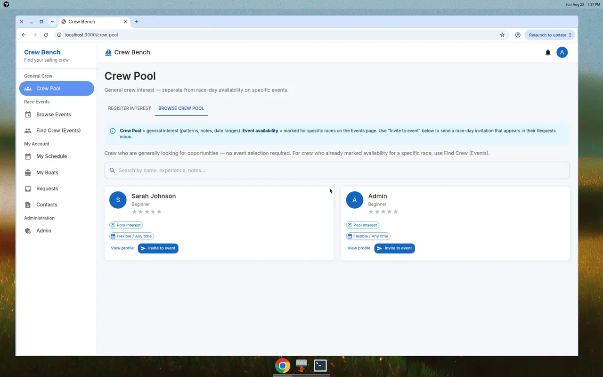

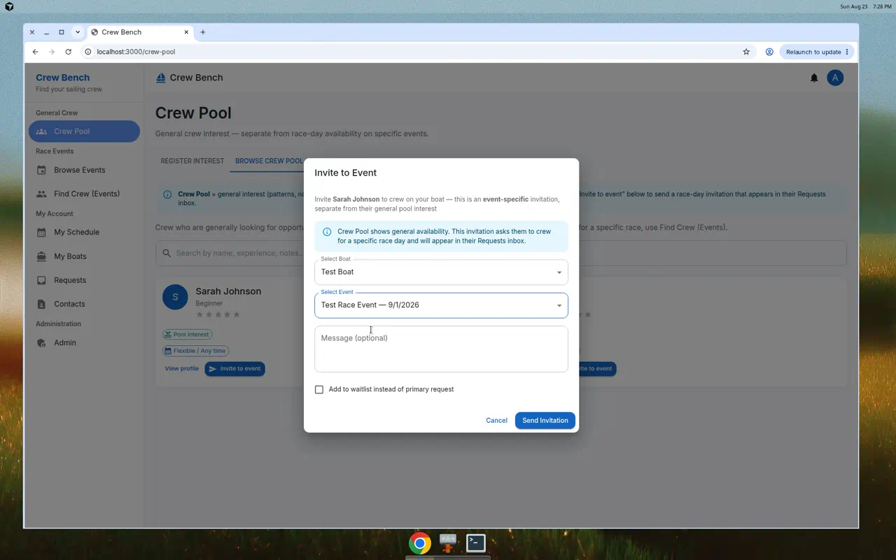

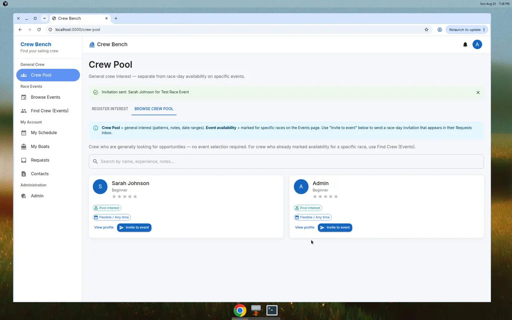

### 3. Race Events — specific races and series

Use **Race Events** when you care about a particular race day or series.

**Mark availability** (crew):

1. Open **Browse Events** under *Race Events*
2. Find an event (or a series) and mark yourself available
3. Optionally prefer any boat, specific boats, or fleets

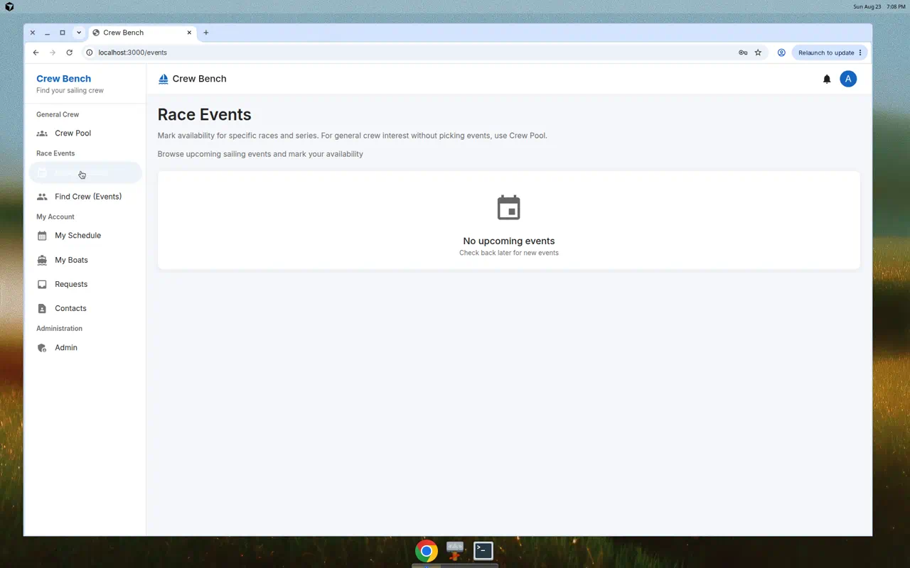

**Find crew for an event** (skippers):

1. Open **Find Crew (Events)**
2. Select an event (or series) and your boat
3. Browse crew who marked availability for that event and send a request

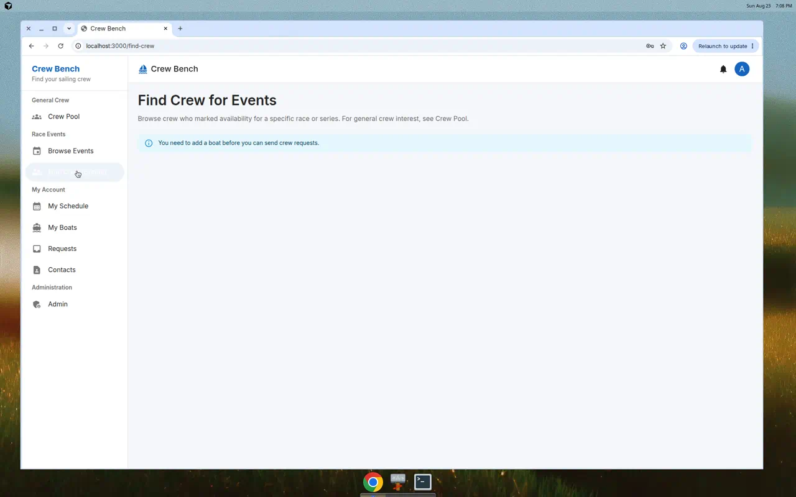

### 4. Requests and schedule

- **Requests** — accept, decline, or manage waitlisted invitations  
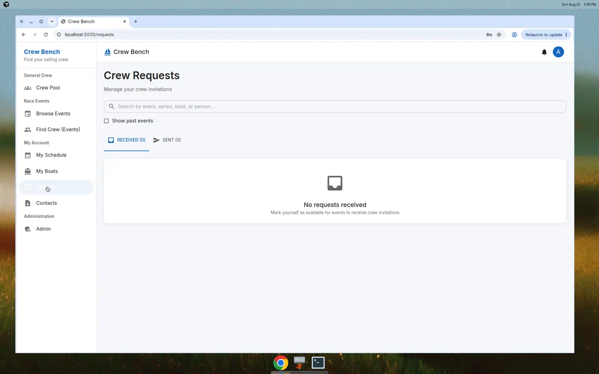

- **My Schedule** — see what you’re sailing (as crew or on your own boat)  
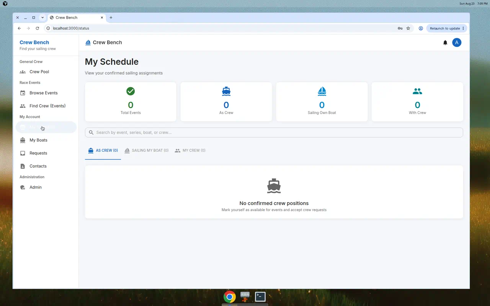

### Navigation overview

| Sidebar section   | Purpose                                      |
|-------------------|----------------------------------------------|
| **General Crew**  | Crew Pool (interest without a specific race) |
| **Race Events**   | Browse Events, Find Crew for a race/series   |
| **My Account**    | Schedule, boats, requests, messages, contacts, profile |

## Tech Stack

- **Backend**: Python/FastAPI
- **Frontend**: React with Material-UI
- **Database**: PostgreSQL
- **Containerization**: Docker Compose

## Quick Start

### Prerequisites

- Docker and Docker Compose installed

### Running the Application

1. Clone the repository and navigate to the project directory:

```bash
cd crew-bench
```

2. Start the application with Docker Compose:

```bash
docker-compose up --build
```

3. Access the application:
   - Frontend: http://localhost:3000
   - Backend API: http://localhost:8000
   - API Documentation: http://localhost:8000/docs

### Default Admin Account

- Email: `admin@crewbench.app`
- Password: `admin123`

## User Roles

### Crew
- Register general interest in the Crew Pool (shortcuts, notes, date ranges)
- Browse events and mark availability for specific races/series
- Receive and respond to crew requests from skippers
- Manage profile with experience level and certifications

### Skipper
- Register boats with details (make, model, crew needed)
- Browse the Crew Pool for generally available crew
- Browse available crew for specific events and send invitations
- Send crew requests

### Admin
- All crew and skipper capabilities
- Create and manage events
- Import events from external racing calendars
- View all registered users

## API Endpoints

### Authentication
- `POST /api/auth/register` - Register new user
- `POST /api/auth/login` - Login and get token
- `GET /api/auth/me` - Get current user
- `PUT /api/auth/me` - Update current user

### Crew Pool
- `GET /api/crew-pool` - List active crew interest profiles
- `GET /api/crew-pool/my` - Get current user’s crew interest
- `PUT /api/crew-pool` - Create or update crew interest
- `DELETE /api/crew-pool` - Remove crew interest profile

### Direct messaging
- `POST /api/conversations` - Start a conversation from the Crew Pool
- `GET /api/conversations` - List conversations
- `GET /api/conversations/{id}` - Get conversation with messages
- `POST /api/conversations/{id}/messages` - Send a reply

### Boats
- `GET /api/boats` - List all boats
- `GET /api/boats/my` - List user's boats
- `POST /api/boats` - Create boat
- `PUT /api/boats/{id}` - Update boat
- `DELETE /api/boats/{id}` - Delete boat

### Events
- `GET /api/events` - List events
- `GET /api/events/{id}` - Get event details
- `POST /api/events` - Create event (admin)
- `PUT /api/events/{id}` - Update event (admin)
- `DELETE /api/events/{id}` - Delete event (admin)

### Crew Availability
- `POST /api/availability` - Mark available for event
- `GET /api/availability/my` - Get my availability
- `GET /api/events/{id}/available-crew` - Get available crew for event
- `DELETE /api/availability/{id}` - Remove availability

### Crew Requests
- `POST /api/crew-requests` - Send crew request
- `GET /api/crew-requests/received` - Get received requests
- `GET /api/crew-requests/sent` - Get sent requests
- `PUT /api/crew-requests/{id}/respond` - Respond to request

### Admin
- `GET /api/admin/users` - List all users
- `POST /api/admin/import-calendar` - Import events from calendar URL

## Development

### Backend Development

```bash
cd backend
pip install -r requirements.txt
uvicorn main:app --reload
```

### Frontend Development

```bash
cd frontend
npm install
npm start
```

### Testing locally with one port (sub-path, like production)

To simulate production (backend on a sub-path of the same host, single port in the browser):

1. **Backend** on port 8000 (e.g. `cd backend && uvicorn main:app --reload`, or use Docker for the backend + DB).
2. **Frontend** on port 3000 with the dev-server proxy (already configured in `package.json`): `cd frontend && npm start`.
3. Use the same origin for the API so requests go through the proxy:
   - Create `frontend/.env.development.local` with:
     ```bash
     REACT_APP_API_URL=
     ```
   - Or run: `REACT_APP_API_URL= npm start`
4. Open only **http://localhost:3000**. All API calls go to `/api/...` on that host and are proxied to the backend on 8000.

Optional: set `PUBLIC_URL=http://localhost:3000` when starting the backend so request logs show that URL.

## Environment Variables

### Backend
- `DATABASE_URL` - PostgreSQL connection string
- `SECRET_KEY` - JWT secret key
- `ADMIN_EMAIL` - Default admin email
- `ADMIN_PASSWORD` - Default admin password
- `RECAPTCHA_SECRET_KEY` - Optional. reCAPTCHA v2 secret key for registration CAPTCHA. If set, new users must pass CAPTCHA verification.
- `VAPID_PUBLIC_KEY` / `VAPID_PRIVATE_KEY` - Optional. Web Push VAPID keys for push notifications. Generate with e.g. `python -m py_vapid` or `npx web-push generate-vapid-keys`.
- `SMTP_HOST`, `SMTP_PORT`, `SMTP_USERNAME`, `SMTP_PASSWORD`, `SMTP_FROM`, `SMTP_USE_TLS` - Optional. When `SMTP_HOST` is set, crew pool alert emails are sent via SMTP; otherwise they are logged (dev/test).
- `CREW_POOL_ALERT_COOLDOWN_SECONDS` - Optional. Per-skipper cooldown between crew pool alert emails (default: 3600). Set to `0` to disable rate limiting.
- `LOG_LEVEL` - Optional. Logging level: DEBUG, INFO, WARNING, ERROR (default: INFO).
- `LOG_FILE` - Optional. Path to log file; if set, logs are also written to a rotating file (see LOG_MAX_BYTES, LOG_BACKUP_COUNT).
- `LOG_MAX_BYTES` - Optional. Max bytes per log file when using LOG_FILE (default: 5MB).
- `LOG_BACKUP_COUNT` - Optional. Number of backup log files to keep (default: 3).
- `PUBLIC_URL` - Optional. Public URL of the app (e.g. `https://app.example.com`). When set, this is logged at startup and included in request log lines so logs reflect the reverse-proxy URL.
- `ROOT_PATH` - Optional. Root path when the API is served behind a reverse proxy at a sub-path (used for OpenAPI docs).
- `CORS_ORIGINS` - Optional. Comma-separated list of allowed CORS origins. The origin derived from `PUBLIC_URL` is automatically allowed when set.

### Frontend
- `REACT_APP_API_URL` - Backend base URL. Omit or set empty in production when the backend is on the same host (e.g. behind a reverse proxy at `/api`); the app will use relative `/api` requests. For local development without a proxy, defaults to `http://localhost:8000`.
- `REACT_APP_RECAPTCHA_SITE_KEY` - Optional. reCAPTCHA v2 site key (must be set if backend uses `RECAPTCHA_SECRET_KEY`).

## Production behind a reverse proxy (e.g. Cloudflare Zero Trust)

When you cannot use different ports and must serve the backend on a sub-path of the same host as the frontend:

1. **Reverse proxy**: Route the same host so that path prefix `/api` is proxied to the backend (e.g. `https://yourapp.com/api/*` → `http://backend:8000/api/*`). Do not strip the path prefix so the backend receives paths like `/api/health`, `/api/auth/login`, etc.

2. **Backend**: Set `PUBLIC_URL` to the public base URL (e.g. `https://yourapp.com`). Optionally set `CORS_ORIGINS` if you need additional origins. Request logs will show the public URL in each line.

3. **Frontend**: Build with `REACT_APP_API_URL` empty (or unset) so API requests go to the same origin (e.g. `https://yourapp.com/api/...`). No separate backend port is needed.

### Sanity check before deployment

Run the reverse-proxy sanity tests and a live health check (starts db and backend with Docker):

```bash
./scripts/sanity_check_proxy.sh
```

Optional: set `PUBLIC_URL` to your public base URL (default `https://app.example.com`) to verify CORS for that origin. The script runs pytest in `backend/tests/test_proxy_sanity.py` and then curls `http://localhost:8000/api/health`.

## License

MIT
